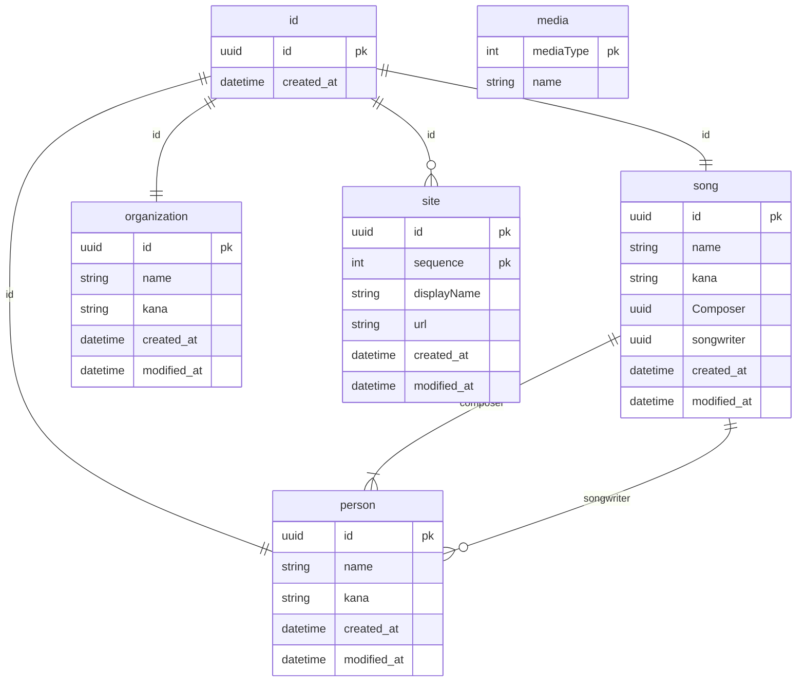

# markdownで書く。
## DB設計のメモ

## 雑記

```mermaid


erDiagram
id{
uuid id pk
datetime created_at
}
song{
uuid id pk
string name
string kana
uuid Composer
uuid songwriter
datetime created_at
datetime modified_at
}
person{
uuid id pk
string name
string kana
datetime created_at
datetime modified_at
}
organization{
uuid id pk
string name
string kana
datetime created_at
datetime modified_at
}
site{
uuid id pk
int sequence pk
string displayName
string url
datetime created_at
datetime modified_at
}
media{
    int mediaType pk
    string name
}
id ||--|| song:id
id ||--|| organization:id
id ||--|| person:id
id ||--o{ site:id
song ||--|{ person:composer
song ||--o{ person:songwriter

```