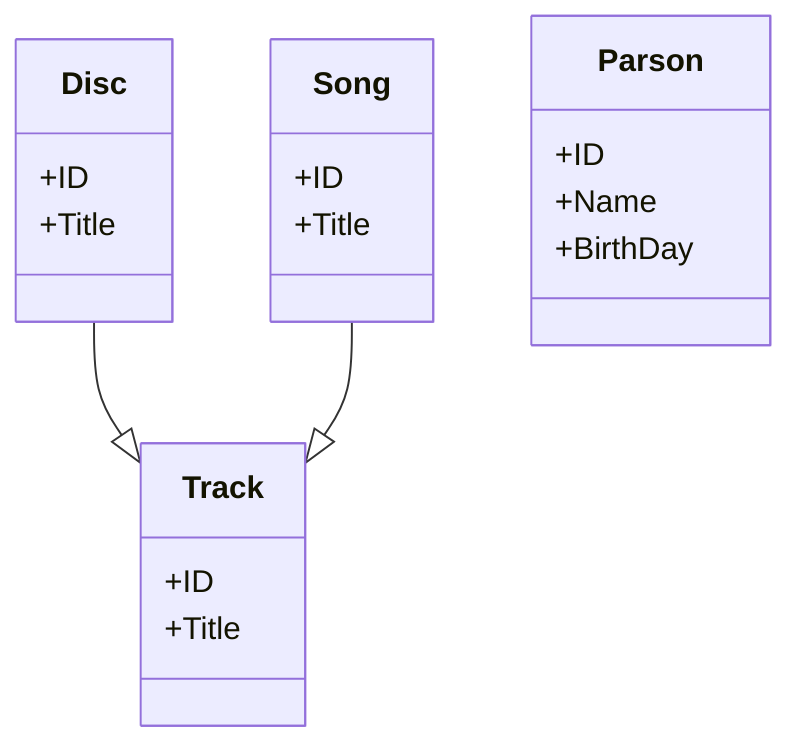

# A first-level heading

```mermaid
classDiagram
    Disc --|> Track
    Song --|> Track
    
    class Disc{
      +ID
      +Title
    }
    class Song{
      +ID
      +Title
    }
    class Track{
      +ID
      +Title
    }
    class Parson{
    +ID
    +Name
    +BirthDay
}
```
